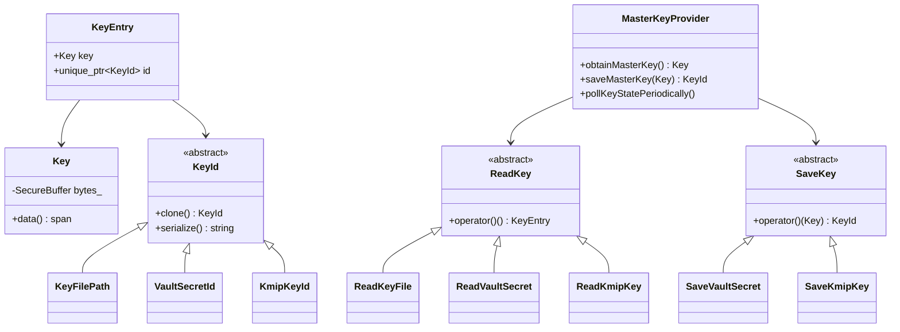
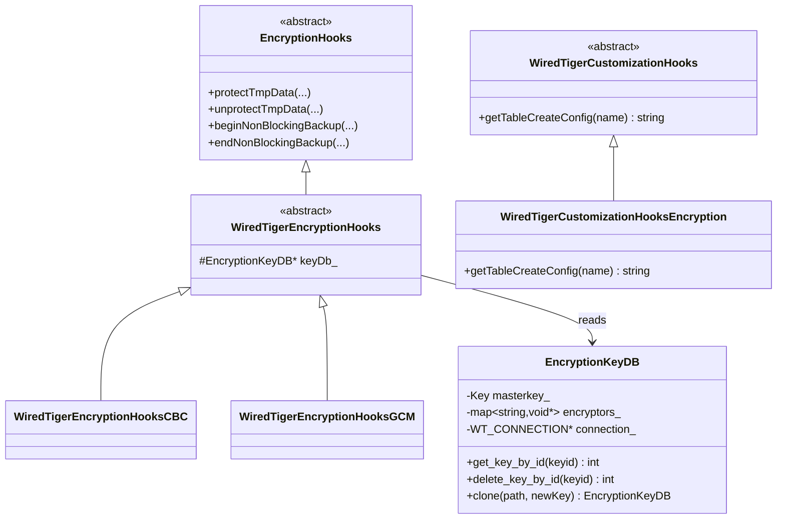
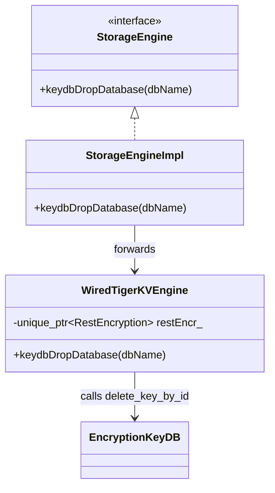
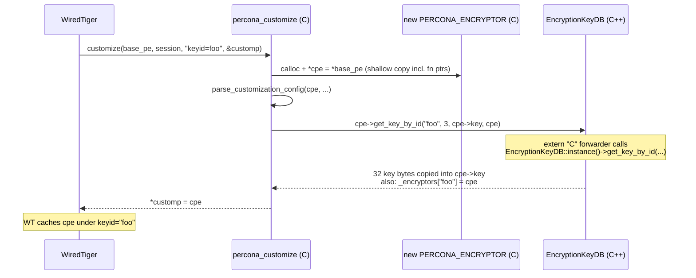
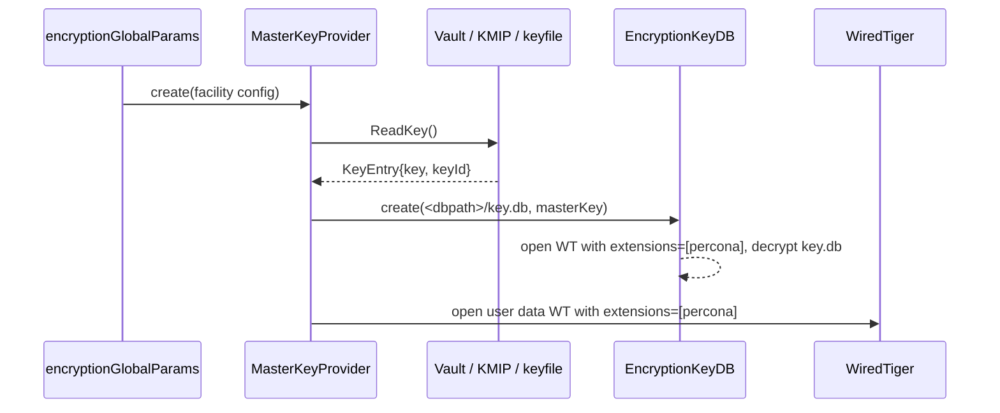
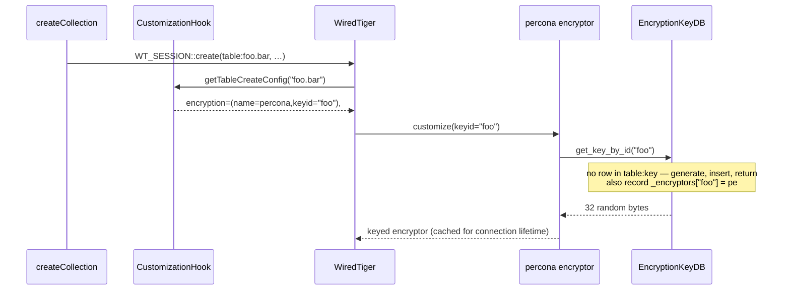
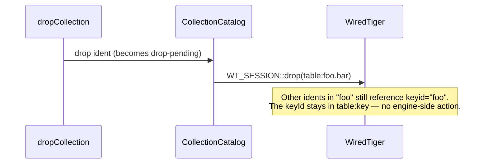
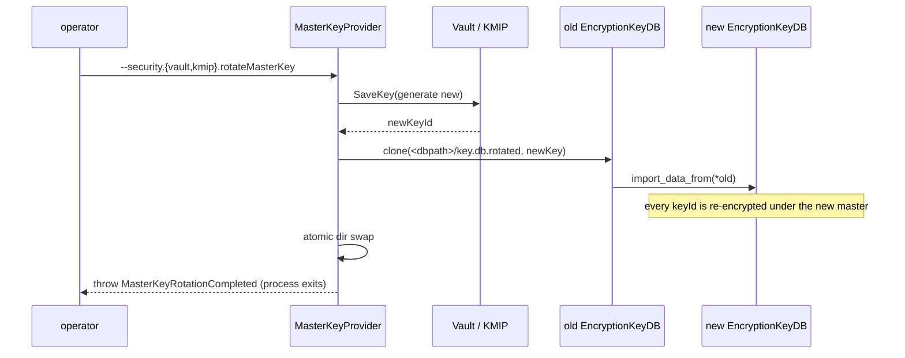

# Percona Transparent Data Encryption (TDE) for MongoDB

This document describes how Percona Server for MongoDB encrypts data at rest.
It covers the master-key facilities, the keystore, the WiredTiger integration,
and the lifecycle of keys when collections, indexes, and databases are created
or dropped.

The reader is expected to be familiar with WiredTiger's encryptor extension
model (see the in-tree doc
[src/third_party/wiredtiger/src/docs/encryption.dox](../../../third_party/wiredtiger/src/docs/encryption.dox))
and the MongoDB ident concept (the storage-layer name for a collection or
index).

---

## 1. Layered architecture

TDE is implemented as three cooperating layers:

```
┌──────────────────────────────────────────────────────────────────────────┐
│  Layer 3 — Master key facility                                           │
│  ─────────────────────────────                                           │
│  Local keyfile  ▸  HashiCorp Vault  ▸  KMIP server                       │
│                                                                          │
│     [encryption/master_key_provider]                                     │
│              │ produces a single 256-bit master key                      │
│              ▼                                                           │
├──────────────────────────────────────────────────────────────────────────┤
│  Layer 2 — Per-database keystore (the "keys DB")                         │
│  ───────────────────────────────────────────                             │
│  A small WiredTiger database, encrypted with the master key, that maps   │
│  keyId → 256-bit ident key. Two tables:                                  │
│                                                                          │
│    table:key            keyId   → key bytes                              │
│    table:active_keyid   dbName  → "<dbName>.<UUID>"                      │
│                                                                          │
│  The keyId for user databases is "<dbName>.<UUID>" — a fresh generation  │
│  is allocated on first ident creation and persisted in                   │
│  table:active_keyid; drop+recreate of the same dbName allocates a new    │
│  generation. System idents continue to use "/default".                   │
│                                                                          │
│     [storage/wiredtiger/encryption_keydb]                                │
│              │ get_key_by_id() / onUriDropped()                          │
│              │ getOrCreateActiveKeyId() / clearActiveKeyId()             │
│              ▼                                                           │
├──────────────────────────────────────────────────────────────────────────┤
│  Layer 1 — WiredTiger integration                                        │
│  ────────────────────────────────                                        │
│  A loadable WT extension named "percona" that calls back into Layer 2    │
│  to fetch keys and to notify on URI drops, plus a customization hook     │
│  that injects encryption=(name=percona,keyid="<dbName>.<UUID>") into     │
│  every WT_SESSION::create for a user ident.                              │
│                                                                          │
│     [storage/wiredtiger/encryption_extension.c]                          │
│     [storage/wiredtiger/wiredtiger_customization_hooks.cpp]              │
│     [storage/wiredtiger/wiredtiger_encryption_hooks.cpp]  (temp data)    │
└──────────────────────────────────────────────────────────────────────────┘
```

Layer 3 holds **one** key per server. Layer 2 holds **one key per database
generation** (plus `/default` for system idents); a generation is created on
first ident under a dbName and lives until every URI that references it has
been durably dropped. Layer 1 attaches the right keyId to every ident at
creation time, asks Layer 2 for the bytes whenever WiredTiger needs to
encrypt or decrypt a page, and notifies Layer 2 when a URI's metadata has
been removed so Layer 2 can drive its per-keyId refcount.

---

## 2. Source map

| Path | Role |
|---|---|
| [src/mongo/db/encryption/](.) | Master key, key IDs, facility clients |
| [encryption_options.h](encryption_options.h) | `encryptionGlobalParams` — config struct populated from the CLI/YAML |
| [master_key_provider.h](master_key_provider.h) | Reads/generates the master key from the configured facility; runs the periodic key-state poll |
| [key.h](key.h) | 256-bit key wrapped in a `SecureAllocator` buffer |
| [key_id.h](key_id.h) | Abstract `KeyId` plus `KeyFilePath`, `VaultSecretId`, `KmipKeyId` |
| [key_operations.h](key_operations.h) | `ReadKey` / `SaveKey` strategy interfaces and per-facility implementations |
| [vault_client.h](vault_client.h) | HTTP client for HashiCorp Vault |
| [kmip_client.h](kmip_client.h) | KMIP protocol client (register / get / poll state) |
| [../storage/wiredtiger/encryption_keydb.h](../storage/wiredtiger/encryption_keydb.h) | The keystore (`EncryptionKeyDB`) |
| [../storage/wiredtiger/encryption_extension.c](../storage/wiredtiger/encryption_extension.c) | The `percona` WT encryptor — `percona_encryption_extension_init`, the `PERCONA_ENCRYPTOR` struct, the WT_ENCRYPTOR callback implementations |
| [../storage/wiredtiger/encryption_keydb_c_api.h](../storage/wiredtiger/encryption_keydb_c_api.h) | `extern "C"` declarations for the C↔C++ bridge functions called by the encryptor (`get_key_by_id`, `get_iv_gcm`, `store_pseudo_bytes`, `notify_uri_dropped`) |
| [../storage/wiredtiger/encryption_keydb_active_keyid.h](../storage/wiredtiger/encryption_keydb_active_keyid.h) | Forward-declaration header for `encryption::getOrCreateActiveKeyIdForDb`, kept WT-include-free so the customization-hooks library can call into the keydb without pulling in `<wiredtiger.h>` |
| [../storage/wiredtiger/wiredtiger_customization_hooks.cpp](../storage/wiredtiger/wiredtiger_customization_hooks.cpp) | Injects the per-ident `encryption=(...)` clause on table create; resolves the active generation keyId via `getOrCreateActiveKeyIdForDb` |
| [../storage/wiredtiger/wiredtiger_encryption_hooks.cpp](../storage/wiredtiger/wiredtiger_encryption_hooks.cpp) | AES-CBC / AES-GCM hooks for **temporary** (non-WT) data |
| [../storage/storage_engine_impl.cpp](../storage/storage_engine_impl.cpp) | `keydbDropDatabase` plumbing — single-line forwarder to the engine |
| [../storage/wiredtiger/wiredtiger_kv_engine.cpp](../storage/wiredtiger/wiredtiger_kv_engine.cpp) | `keydbDropDatabase` clears the dbName → keyId mapping (no eager key-row delete); seeds the per-keyId refcount at startup via `seedRefcountsFromWtMetadata` |

---

## 3. Class hierarchy

The encryption code is dominated by three small abstract families plus a
keystore. There is no deep inheritance; the abstractions exist so that each
master-key facility can plug in its own read/save strategy without the rest of
the engine knowing how it works.







---

## 4. The keystore in detail

[`EncryptionKeyDB`](../storage/wiredtiger/encryption_keydb.h) is a WiredTiger
database stored in `<dbpath>/key.db/`. Its file pages are encrypted with the
master key produced by Layer 3. It holds two logical tables:

| WT table | Key | Value | Purpose |
|---|---|---|---|
| `table:key` | keyId | 32 bytes | The actual ident keys |
| `table:active_keyid` | dbName | "<dbName>.<UUID>" | Currently-active generation keyId for each database |

Two reserved keyIds:

* **empty string `""`** — the master key itself. `get_key_by_id` short-circuits
  on `len == 0` and copies the master key bytes directly out of `_masterkey`
  ([encryption_keydb.cpp:355-363](../storage/wiredtiger/encryption_keydb.cpp)).
* **`"/default"`** — used for system idents and any ident whose `tableName`
  starts with `system` or `table:` (see
  [wiredtiger_customization_hooks.cpp](../storage/wiredtiger/wiredtiger_customization_hooks.cpp)).

User idents use a **per-database generation keyId** of the form
`<dbName>.<UUID>`. The first `getTableCreateConfig` call for a database
allocates a fresh UUID, persists `dbName -> "<dbName>.<UUID>"` in
`table:active_keyid`, and uses that string as the encryption keyid. Every
subsequent ident in the same database picks up the same row's value. When
`keydbDropDatabase` runs, it clears the row from `table:active_keyid`; the
next ident under that dbName allocates a brand-new generation. Significant
properties:

1. Drop+recreate never reuses a keyId. The cached per-keyid `WT_ENCRYPTOR`
   that WiredTiger holds is bound to the old generation's UUID and is
   correctly orphaned when the new generation is allocated.
2. The keyId space grows without bound on `table:key` only as long as drop-
   pending idents reference older generations. Cleanup is event-driven off
   WiredTiger's URI lifecycle (§5.5, §6.4).

**Legacy bare keyIds.** Idents created on `master`, before the upgrade,
carry the legacy bare-dbName keyId (`keyid="foo"`, no UUID). They remain
fully decryptable: the keyId string is opaque to the refcount machinery, and
the legacy row in `table:key` continues to back any drop-pending ident that
references it. Drop+recreate of a legacy database allocates a fresh
`<dbName>.<UUID>` for the new generation; the legacy row is reaped via the
same refcount path once every ident that referenced it is durably dropped.
No flag day, no migration step.

In addition to the on-disk tables, `EncryptionKeyDB` keeps an in-memory
**per-keyId refcount** `_refcounts : map<string, size_t>` that drives
cleanup. The count is the sum of:

* **1 per active mapping** — one anchor unit while a row in
  `table:active_keyid` references the keyId. Allocated by
  `getOrCreateActiveKeyId` and released by `clearActiveKeyId`. The anchor
  prevents a freshly-allocated generation that has not yet had its first
  ident bound to it from being prematurely reaped.
* **1 per live URI** — incremented in `get_key_by_id` (called from the
  encryption extension's `customize` callback exactly once per (URI,
  keyId) binding) and decremented in `onUriDropped` (driven from
  `WT_ENCRYPTOR::uri_dropped`, fired after the URI's metadata is durably
  removed from `WiredTiger.wt`).

When the count reaches zero, the row in `table:key` is deleted via
`delete_key_by_id` and the WiredTiger cached customized-encryptor slot is
released via `WT_CONNECTION::release_encryptor`. At startup,
`seedRefcountsFromWtMetadata` rebuilds the URI portion of the count by
walking the user-data WT metadata's `file:` URIs, then layers in one anchor
unit per row in `table:active_keyid`.

---

## 5. WiredTiger wiring

This section explains how Layer 1 (the C extension) fits the WT_ENCRYPTOR
contract, how it reaches back into Layer 2 to fetch keys, and how the result
ties into the higher-level MongoDB plumbing.

### 5.1 The WT_ENCRYPTOR contract

WiredTiger's encryption extension API is a single struct of function pointers
declared in
[wiredtiger.h.in:4759](../../../third_party/wiredtiger/src/include/wiredtiger.h.in)
(rendered as `wiredtiger.h` in the build tree). An extension registers an
encryptor under a name (here, `"percona"`) and WT calls it through these
hooks:

| Callback | When WT calls it | What it must do |
|---|---|---|
| `customize(encryptor, session, encrypt_config, customp)` | First time WT sees a given `keyid="..."` clause (at `WT_SESSION::create` or `wiredtiger_open`) | Allocate a new encryptor instance bound to that keyId; set `*customp` to it. WT caches this pointer per-keyid. |
| `encrypt(encryptor, session, src, src_len, dst, dst_len, result_lenp)` | On every page write | Encrypt `src` plaintext into `dst`, set `*result_lenp` to the ciphertext length |
| `decrypt(encryptor, session, src, src_len, dst, dst_len, result_lenp)` | On every page read | Reverse direction |
| `sizing(encryptor, session, expansion_constantp)` | Once per encryptor | Set `*expansion_constantp` to the *worst-case* number of extra bytes encryption adds (IV + tag + padding). WT uses this to size its destination buffers. |
| `terminate(encryptor, session)` | At connection close, or from `WT_CONNECTION::release_encryptor`, for every customized encryptor instance that was returned by `customize` | Free resources |
| `uri_dropped(encryptor, session, uri, keyid)` | **Percona-carried addition.** After `WT_SESSION::drop` removes a URI's metadata from `WiredTiger.wt`. Lets an extension drive per-keyId cleanup off WT's URI lifecycle. | Notify Layer 2 that a URI under this keyId is durably gone (decrement the refcount, possibly reap) |

Important contract details that drive the rest of the design:

* The `encrypt` / `decrypt` / `sizing` callbacks **never see the keyId** — they
  use whatever key the encryptor instance carries in its private state. That
  binding happens once in `customize`.
* WT caches the per-keyid encryptor pointer for the lifetime of the
  connection. To evict a cache entry — for example when the keyId's last
  URI has been dropped — the engine calls `WT_CONNECTION::release_encryptor`
  (a Percona-carried API addition; see §5.5). The next `WT_SESSION::create`
  naming the same keyId reaches `customize` again and allocates a fresh
  cached entry.
* `sizing` returns a constant. WT calls it once per encryptor and trusts the
  answer forever, so the per-record overhead must be a fixed worst-case.

### 5.2 Connection-time setup

When TDE is enabled, [`setUpWiredTigerEncryption`](../storage/wiredtiger/wiredtiger_kv_engine.cpp)
prepends this string to the WT connection-open config:

```
local=(entry=percona_encryption_extension_init,early_load=true,config=(cipher=AES256-GCM))
```

`early_load=true` is required: the extension must be registered before WT
attempts to read its own metadata, since the metadata file is itself
encrypted. The `cipher=` value comes from `--security.encryptionCipherMode`.
The same extension string is also added to `SpillWiredTigerExtensions` so that
spill files use the same encryptor.

WT calls
[`percona_encryption_extension_init`](../storage/wiredtiger/encryption_extension.c)
once per connection. That function:

1. Allocates a `PERCONA_ENCRYPTOR` struct (see §5.3).
2. Wires the WT callbacks: `customize = percona_customize`, `terminate =
   percona_terminate`, `sessioncreate = NULL` (it gets set later, only on a
   per-keyid drop).
3. Calls `init_from_config` to bind the cipher-specific callbacks based on
   `cipher=AES256-CBC` or `AES256-GCM`:
   * CBC → `encrypt = percona_encrypt_cbc`, `decrypt = percona_decrypt_cbc`,
     `sizing = percona_sizing_cbc`
   * GCM → `encrypt = percona_encrypt_gcm`, `decrypt = percona_decrypt_gcm`,
     `sizing = percona_sizing_gcm`
4. `init_from_config` also wires the C↔C++ bridge function pointers
   (`get_key_by_id`, `get_iv_gcm`, `store_pseudo_bytes`) — see §5.3.
5. Calls `connection->add_encryptor(connection, "percona", pe, NULL)` to
   register the encryptor with WT under the name `"percona"`.

At this point WT knows about the encryptor but no key bytes have been loaded.
Keys arrive lazily via `customize`.

### 5.3 The PERCONA_ENCRYPTOR struct and the C↔C++ bridge

[`PERCONA_ENCRYPTOR`](../storage/wiredtiger/encryption_extension.c) is the
struct WT actually receives — a `WT_ENCRYPTOR` "subclass" that bolts on
everything Percona needs:

```c
typedef struct {
    WT_ENCRYPTOR encryptor;        // must be first — WT only sees this prefix
    WT_EXTENSION_API* wt_api;
    const EVP_CIPHER* cipher;      // EVP_aes_256_cbc() or EVP_aes_256_gcm()
    int iv_len;
    unsigned char key[KEY_LEN];    // 32 bytes; populated by customize/sessioncreate
    uint32_t (*wiredtiger_checksum_crc32c)(const void*, size_t);
    void    (*store_pseudo_bytes)(uint8_t* buf, int len);
    int     (*get_iv_gcm)(uint8_t* buf, int len);
    int     (*get_key_by_id)(const char* keyid, size_t len,
                             unsigned char* key, void* pe);
} PERCONA_ENCRYPTOR;
```

Two things make this work as a C↔C++ bridge:

**1. The WT_ENCRYPTOR prefix.** WT receives a `WT_ENCRYPTOR*` and never knows
about the trailing fields. The C extension casts back: `PERCONA_ENCRYPTOR* pe
= (PERCONA_ENCRYPTOR*)encryptor;` on every callback entry. That's how
`encrypt` / `decrypt` reach the cipher, key, IV length, and the C-bridge
function pointers without changing WT's interface.

**2. C-linkage function pointers populated at init.** The bridge functions
are declared in
[encryption_keydb_c_api.h](../storage/wiredtiger/encryption_keydb_c_api.h)
with `extern "C"` and *defined in
[encryption_keydb.cpp](../storage/wiredtiger/encryption_keydb.cpp)* as thin
forwarders to the singleton `EncryptionKeyDB::instance()`. `init_from_config`
stores their addresses in `pe`:

```c
pe->store_pseudo_bytes = &store_pseudo_bytes;
pe->get_iv_gcm         = &get_iv_gcm;
pe->get_key_by_id      = &get_key_by_id;
```

Now the C extension can call back into MongoDB-side code without linking
against C++ symbols. Every callback that needs a key, an IV, or randomness
goes through these pointers.

For master-key rotation, `init_from_config` swaps in `rotation_*` variants
that target the temporary "rotation" `EncryptionKeyDB` instance instead of
the live one — the cipher-level code is unchanged.

#### Per-keyid customization flow



The line `*cpe = *base_pe` is what makes per-keyid encryptors cheap: a
single struct copy clones the cipher binding, IV length, and **all four
bridge function pointers**. Only `cpe->key` differs from sibling encryptors.

The fourth argument to `get_key_by_id` is the `cpe` pointer itself. Layer 2
stores it in `EncryptionKeyDB::_encryptors[keyid]` so that, much later,
`delete_key_by_id` can call back into the C extension via
`percona_encryption_extension_drop_keyid(cpe)` to invalidate this exact
cached encryptor — see §5.5.

### 5.4 Per-ident config injection

[`WiredTigerCustomizationHooksEncryption::getTableCreateConfig`](../storage/wiredtiger/wiredtiger_customization_hooks.cpp)
is called from two distinct places in the engine:

**1. Twice per server startup, with the hardcoded name `"system"`** — once for
each of mongod's two WT connections (the main user-data engine and the spill
engine used for sort spills). Invoked from
[`generateWTOpenConfigString`](../storage/wiredtiger/wiredtiger_kv_engine.cpp)
while building the `wiredtiger_open()` connection config. The dbName parses as
`"system"`, hits the special-case branch in the hook, and returns
`encryption=(name=percona,keyid="/default")`. This is what encrypts WT's own
connection-level state: the metadata file (`WiredTiger.wt`), the journal, and
all internal scratch tables that don't have an explicit per-ident encryption
clause. *This call fires on every startup* because both connections are
opened every startup. There is also a third hardcoded call at startup, from
[`WiredTigerSizeStorer`'s
constructor](../storage/wiredtiger/wiredtiger_size_storer.cpp), which calls
`WT_SESSION::create("table:sizeStorer", ...)` idempotently — the URI starts
with `table:`, so the hook returns `/default` and the size-storer table
shares the system key.

**2. Once per ident, at first creation** — invoked from
`WT_SESSION::create` when MongoDB creates a new collection or index. Rebuild
and import paths
([`_rebuildIdent`](../storage/wiredtiger/wiredtiger_kv_engine.cpp),
[`importRecordStore`](../storage/wiredtiger/wiredtiger_kv_engine.cpp)) also
call `create`, but they pass the ident's existing metadata through verbatim —
the hook does not run because the encryption clause is already present in
that metadata. On reopen (server restart, cursor opens) `create` is not
called at all; WT replays the encryption clause it stored at first create.

The hook itself doesn't distinguish between the two callers — same code,
different `tableName` argument:

```cpp
NamespaceString ns = NamespaceStringUtil::deserialize(boost::none, tableName, …);
std::string keyIdStr = DatabaseNameUtil::serialize(ns.dbName(), …);
StringData keyid(keyIdStr);
if (keyid.size() >= 6 && (keyid == "system"_sd || keyid.starts_with("table:"_sd)))
    keyid = "/default"_sd;
return str::stream() << "encryption=(name=percona,keyid=\"" << keyid << "\"),";
```

So each WT table is born with the keyId baked into its creation metadata — and
since the keyId is just the dbName, every ident in a database shares one key.
WT then stores that keyId in its own metadata file and uses it on every
subsequent open of that table; no MongoDB-side lookup happens during
steady-state I/O.

### 5.5 The keyed-encryptor cache, `uri_dropped`, and `release_encryptor`

WT's per-keyid encryptor cache is populated by the customize flow in §5.3 —
once filled, WT reuses the cached `WT_ENCRYPTOR*` for every URI naming the
same keyid for the lifetime of the connection. The two questions for the
TDE design are:

1. **Cache correctness across drop+recreate.** A naive design that reuses a
   keyId across drop+recreate would hand WT a stale cached encryptor on the
   recreate path, encrypting new data with the dropped generation's key
   bytes — silent corruption. PSMDB sidesteps this entirely by allocating a
   **fresh `<dbName>.<UUID>` keyId on every (re)create** (§4). The cache
   key is per-generation, so a recreated database is always a cache miss
   that triggers `customize` against the new generation's row in
   `table:key`. There is no path by which a recycled cache slot can be
   incorrect.
2. **Cache lifetime.** Without an eviction mechanism, a long-running
   connection that performs many drop+recreate cycles accumulates one
   encryptor cache slot per cycle for the connection's lifetime. The fix
   is two new WiredTiger extension API surfaces, carried as a Percona
   delta on `src/third_party/wiredtiger/`:

   * **`WT_ENCRYPTOR::uri_dropped(encryptor, session, uri, keyid)`** — fired
     by WT from the file-drop path after `__wt_metadata_remove` has
     succeeded. Lets the extension see a "this URI is durably gone" signal.
     The percona extension wires this to `percona_uri_dropped`, which
     forwards through the C bridge `notify_uri_dropped` to
     `EncryptionKeyDB::onUriDropped`. `onUriDropped` decrements the
     per-keyId refcount and, when it hits zero, drives the next step.
   * **`WT_CONNECTION::release_encryptor(connection, keyid)`** — called by
     the engine when the refcount reaches zero. Walks WT's per-keyid
     encryptor cache, removes the entry for `keyid`, calls the customized
     encryptor's `terminate` callback, and frees the cache bookkeeping.
     The next `WT_SESSION::create` naming this keyId is a clean cache miss
     and triggers `customize` afresh.

The pair lets the engine drive its lifecycle cleanly off WT's URI events
instead of polling, racing the checkpoint, or pretending to know when WT
has finished with a file. Both additions are pre-positioned for upstream
pitch to MongoDB-WT; the precedent for carrying a Percona-only WT delta of
this shape is the older `WT_ENCRYPTOR::sessioncreate` field, which was
retired by the move to generation keyIds and the introduction of
`uri_dropped` / `release_encryptor`.

This mechanism is invisible from MongoDB's side; it lives entirely between
`EncryptionKeyDB` and the C extension.

### 5.6 On-wire encrypted layout

The `encrypt` / `decrypt` callbacks have a fixed wire format per cipher mode.
Both layouts are completely opaque to WiredTiger — WT just hands `dst` to the
filesystem layer and treats it as bytes — but the layout is what `sizing`
needs to budget for, and what `decrypt` needs to parse on read.

**AES-256-CBC** ([percona_encrypt_cbc:233](../storage/wiredtiger/encryption_extension.c)):

```
┌─────────────┬────────────────────┬──────────────────────────────┐
│ CRC32C (4B) │ IV (16B, random)   │ AES-256-CBC ciphertext (N+pad) │
└─────────────┴────────────────────┴──────────────────────────────┘
   integrity     uniqueness          padded to 16B block boundary
```

* CRC32C is computed over the **plaintext** (before encryption) using WT's
  built-in `wiredtiger_crc32c_func()`. That function pointer is captured into
  `pe->wiredtiger_checksum_crc32c` at extension-init time. On decrypt, after
  AES-CBC decryption, the CRC32C is recomputed and compared. CBC by itself
  has no integrity, so this is what guards against ciphertext tampering or
  bit-flip corruption.
* The IV is fresh random per record, sourced from `pe->store_pseudo_bytes`
  which forwards to `EncryptionKeyDB::store_pseudo_bytes`. IV reuse with the
  same key under CBC leaks structural information about plaintext, so this
  must be unique per encryption.
* `sizing` for CBC returns `iv_len + EVP_CIPHER_block_size(cipher) +
  CHKSUM_LEN` = `16 + 16 + 4` = **36 bytes** worst-case overhead.

**AES-256-GCM** ([percona_encrypt_gcm:304](../storage/wiredtiger/encryption_extension.c)):

```
┌──────────────┬───────────────────────┬──────────────────┐
│ IV (12B)     │ AES-256-GCM cipher (N) │ GCM auth tag (16B) │
└──────────────┴───────────────────────┴──────────────────┘
   counter        no padding              authenticated integrity
```

* The IV is **not random** — it's a 96-bit counter sourced from
  `pe->get_iv_gcm` → `EncryptionKeyDB::get_iv_gcm`. GCM requires unique IVs
  per (key, plaintext) pair; reusing an IV-key pair is catastrophic (it
  enables plaintext recovery). The counter approach is safer than random
  with such a short IV. The counter is persisted in the keys DB
  (`_gcm_iv` / `_gcm_iv_reserved`) so it survives restart.
* GCM provides built-in integrity via the 16-byte authentication tag — no
  separate CRC32C. The tag is appended to the ciphertext and verified on
  decrypt.
* No padding: GCM is a stream cipher mode (counter mode under the hood).
  Ciphertext length equals plaintext length.
* `sizing` for GCM returns `iv_len + GCM_TAG_LEN` = `12 + 16` = **28 bytes**
  fixed overhead per record.

The CBC variant exists primarily for compatibility with older deployments;
new installations should prefer GCM, which has better security (built-in
integrity, no padding-oracle risk) and cheaper sizing.

### 5.7 Cipher modes for non-WT data

`EncryptionHooks::protectTmpData` / `unprotectTmpData` are the engine's API
for encrypting data that does not go through WiredTiger pages — sort spills,
external sort temp files, etc. Two implementations:

* `WiredTigerEncryptionHooksCBC` — `IV || ciphertext || CRC32C`
* `WiredTigerEncryptionHooksGCM` — `IV || ciphertext || 16-byte tag`

Both ask `EncryptionKeyDB` for the master key bytes; temp data does not get a
per-database key.

---

## 6. Use cases (sequence diagrams)

### 6.1 Server startup



If `--security.vault.rotateMasterKey` or `--security.kmip.rotateMasterKey` is
set, the provider also generates a new master key, calls
`EncryptionKeyDB::clone(newPath, newKey)` to re-emit `key.db` under the new
master, atomically swaps directories, and exits with
`MasterKeyRotationCompleted`.

### 6.2 First ident in a new database



Subsequent `createCollection` / `createIndex` calls in the same database
still go through `getTableCreateConfig` (since each one is a fresh
`WT_SESSION::create`), but the keyid string they emit is the same `"foo"`,
so WT's `customize` callback hits the cached `WT_ENCRYPTOR*` and does not
re-enter `EncryptionKeyDB`. After a server restart, the encryption clause is
replayed from WT's metadata when the table is first opened, repopulating the
cache via `customize` → `get_key_by_id` — `getTableCreateConfig` is not
involved on this path.

### 6.3 Drop a collection or index (within a kept database)



There is no per-ident key-cleanup path. Keys are deleted only when the
*database* is dropped; while the database lives, its key lives.

### 6.4 Drop a database

The drop is **event-driven**: the engine clears the active mapping
synchronously, but the underlying key row in `table:key` and WT's cached
customized-encryptor slot are reaped only after WiredTiger reports each URI
as durably dropped via `uri_dropped`.

```mermaid
sequenceDiagram
    participant cmd as dropDatabase
    participant se as StorageEngineImpl
    participant kv as WiredTigerKVEngine
    participant kdb as EncryptionKeyDB
    participant wt as WiredTiger
    participant ext as percona_encryption_extension

    Note over cmd: collections in "foo" are dropped first;<br/>each collection drop fires WT_SESSION::drop on its ident

    loop for every ident under foo.UUID-A
        wt->>wt: drop URI metadata
        wt->>ext: WT_ENCRYPTOR::uri_dropped(uri, "foo.UUID-A")
        ext->>kdb: notify_uri_dropped("foo.UUID-A")
        kdb->>kdb: --_refcounts["foo.UUID-A"]
    end

    cmd->>se: keydbDropDatabase("foo")  (inside WUOW::commit)
    se->>kv: keydbDropDatabase("foo")
    kv->>kdb: clearActiveKeyId("foo")
    kdb->>kdb: cursor->remove on table:active_keyid for "foo"
    kdb->>kdb: --_refcounts["foo.UUID-A"] (the active anchor)

    alt refcount["foo.UUID-A"] is now 0
        kdb->>kdb: delete_key_by_id("foo.UUID-A")
        kdb->>wt: WT_CONNECTION::release_encryptor("foo.UUID-A")
        wt->>ext: terminate()
    else refcount > 0
        Note over kdb: drop-pending idents still reference foo.UUID-A;<br/>reap deferred until last uri_dropped fires
    end
```

Two important properties of this path:

* `keydbDropDatabase` runs **inside `WUOW::commit`**, after every other part
  of the database has already been dropped. It only mutates the keys DB's
  in-memory bookkeeping plus the small `table:active_keyid` row; the
  expensive work (key-row delete, WT cache eviction, possible
  `terminate` callback) only happens when the refcount actually hits zero,
  which is typically *not* during the WUOW commit.
* The key-row delete is **deferred**, not eager. The previous-generation key
  bytes remain decryptable while WiredTiger still has drop-pending idents
  that reference them. The eager delete inside the WUOW commit on `master`
  was the source of the PSMDB-1997 race against checkpoint cleanup; this
  design eliminates the race because the row is only deleted *after*
  `uri_dropped` confirms WiredTiger no longer needs it.

### 6.5 Master key rotation



Rotation does not touch user idents — those are still encrypted with their
own per-database keys. Only the wrapping changes.

### 6.6 Backup / restore

* `EncryptionHooks::beginNonBlockingBackup` walks down to
  `EncryptionKeyDB::beginNonBlockingBackup`, which opens a backup cursor over
  the keys DB and returns the file list to be copied alongside the user DB.
* On restore, the new server boots with the same master key facility config
  and the same `<dbpath>/key.db/` files; the keys decrypt normally.

---

## 7. Configuration reference

All options live under `security.*` in the YAML config, equivalent CLI
`--security.<dotted.path>`. Source:
[mongod_options_encryption.idl](../mongod_options_encryption.idl).

### Master switch and cipher

| Option | Type | Default | Notes |
|---|---|---|---|
| `security.enableEncryption` | bool | false | Required for any TDE option to take effect |
| `security.encryptionCipherMode` | string | `AES256-CBC` | or `AES256-GCM` |

### Local keyfile (mutually exclusive with Vault and KMIP)

| Option | Notes |
|---|---|
| `security.encryptionKeyFile` | Path to file containing the master key |

### HashiCorp Vault (mutually exclusive with keyfile and KMIP)

| Option | Notes |
|---|---|
| `security.vault.serverName` | Required to enable Vault |
| `security.vault.port` | |
| `security.vault.tokenFile` | Path to file with auth token |
| `security.vault.secret` | Secret path |
| `security.vault.secretVersion` | 0 = latest |
| `security.vault.rotateMasterKey` | Boot, rotate, exit |
| `security.vault.serverCAFile` | TLS CA |
| `security.vault.checkMaxVersions` | Default true |
| `security.vault.disableTLSForTesting` | Dev only |

### KMIP (mutually exclusive with keyfile and Vault)

| Option | Notes |
|---|---|
| `security.kmip.serverName` | One or more hostnames (comma-separated for failover) |
| `security.kmip.port` | Default 5696 |
| `security.kmip.serverCAFile` | TLS CA |
| `security.kmip.clientCertificateFile` | Client cert/key PEM |
| `security.kmip.clientCertificatePassword` | If the cert key is encrypted |
| `security.kmip.connectRetries` | |
| `security.kmip.connectTimeoutMS` | Default 5000 |
| `security.kmip.keyIdentifier` | KMIP unique identifier of the master key |
| `security.kmip.rotateMasterKey` | Boot, rotate, exit |
| `security.kmip.activateKeys` | Default true — auto-Activate newly registered keys |
| `security.kmip.keyStatePollingSeconds` | Default 900 — poll Active state |
| `security.kmip.useLegacyProtocol` | KMIP protocol version selection |

---

## 8. Invariants worth preserving

* The `percona` extension must load with `early_load=true`. Anything that
  reorders WT extensions has to keep this property, or WT cannot read its own
  encrypted metadata.
* `getTableCreateConfig` is called from two places (see §5.4): once per
  startup with `"system"` while building the `wiredtiger_open` config, and
  once per ident at first `WT_SESSION::create`. Both must produce the right
  `encryption=(...)` clause. The per-ident call is the *only* chance to
  inject the clause into a table's persistent metadata: the clause is then
  stored in WT's metadata file and replayed on every subsequent open, so the
  hook is *not* consulted on cursor opens, server restart, or rebuild/import
  paths (those preserve the clause from existing metadata via
  `getMetadataCreate` or the supplied `storageMetadata`). Dropping the hook
  on the initial-create path, or reordering it after the create, loses
  encryption silently — and silently means forever, since there is no second
  chance.
* `EncryptionKeyDB::onUriDropped` is the **single** place that deletes a row
  from `table:key`. It is invoked only via the engine's per-keyId
  refcount-zero path (decremented from `WT_ENCRYPTOR::uri_dropped` for
  every dropped URI, and from `clearActiveKeyId` for the active-mapping
  anchor). Bypassing the refcount — for example, calling
  `delete_key_by_id` directly during the WUOW commit, as on `master` —
  reintroduces the race against WiredTiger's checkpoint cleanup that
  PSMDB-1997 originally fixed.
* Every call into `get_key_by_id` (driven by the encryption extension's
  `customize` callback) must increment `_refcounts[keyid]` exactly once,
  paired with exactly one matching decrement from `onUriDropped` when WT's
  drop path fires. Underflow is defensive — `onUriDropped` for a keyId
  not in the map logs a warning and no-ops — but a missed increment would
  leak the key row indefinitely.
* `WT_CONNECTION::release_encryptor` must be invoked exactly when the
  refcount hits zero, paired with the `delete_key_by_id` of the same row.
  Skipping it leaks one cache slot per drop+recreate cycle on long-running
  connections; calling it without the row delete leaves a row that can
  never reach the `customize` path again because the cache is empty but
  the row is still there as a phantom.
* `EncryptionKeyDB::seedRefcountsFromWtMetadata` must run after the user-
  data WT connection is open and before any user op can fire `uri_dropped`.
  Without it the first drop on a restarted server hits a defensive
  warning and the row leaks. The current call site is
  `WiredTigerKVEngine::WiredTigerKVEngine` immediately after
  `_openWiredTiger` returns.
* `keydbDropDatabase` runs inside `WUOW::commit` and must not throw.
  Errors are logged and the commit proceeds. With the deferred-delete
  design the in-WUOW work is a small `table:active_keyid` row removal plus
  a possible refcount-zero reap; both are best-effort and log on failure.
* Master key rotation works by emitting a fresh `key.db` directory via
  `EncryptionKeyDB::clone` and swapping directories at the FS level — the
  in-place option is intentionally not supported.
