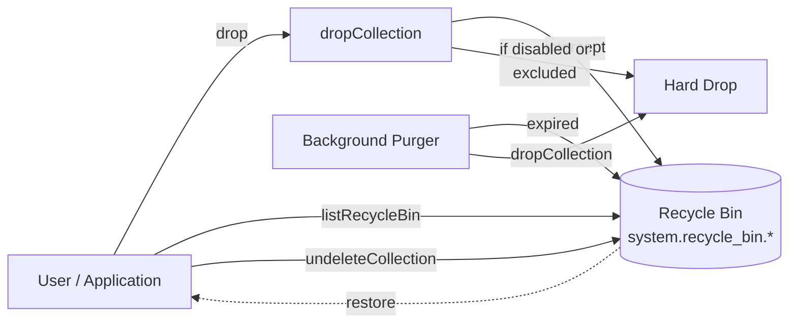
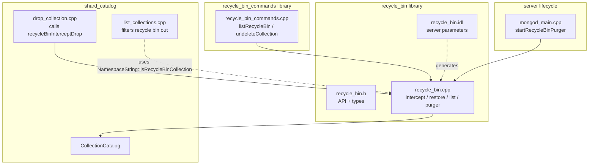
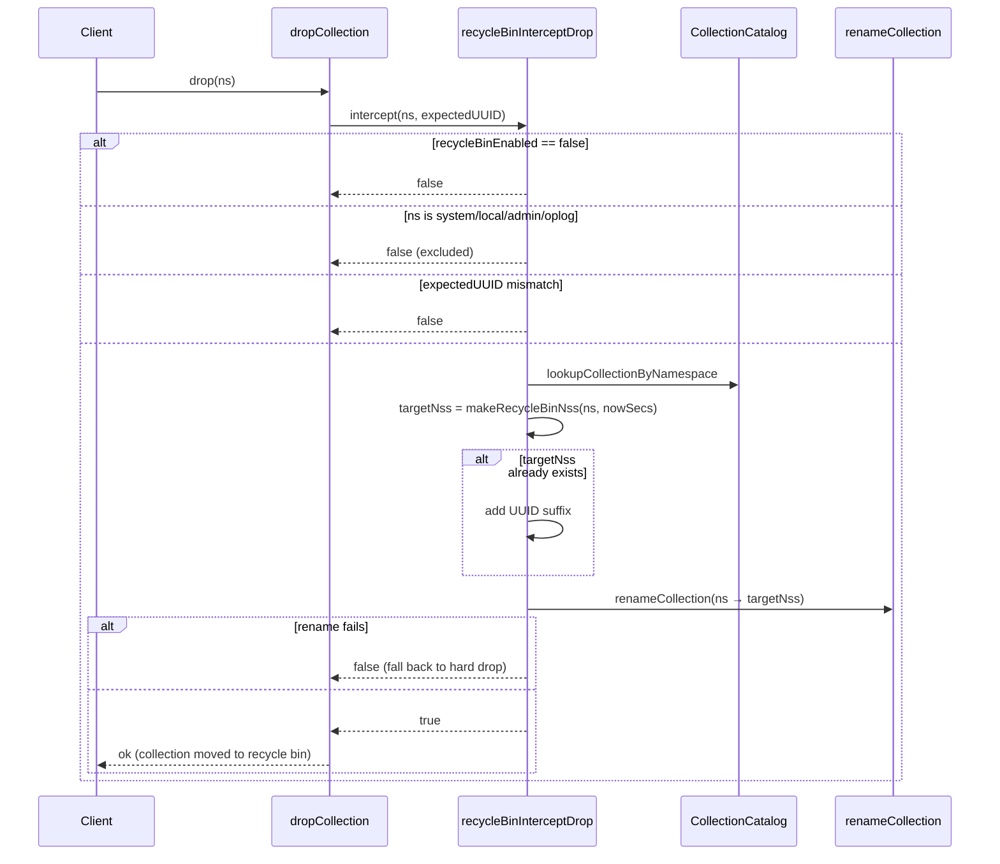
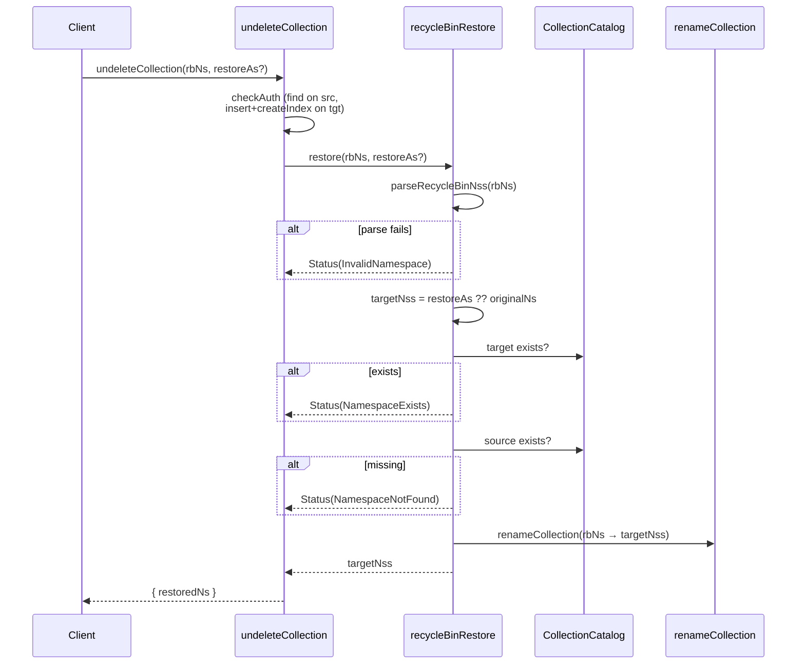
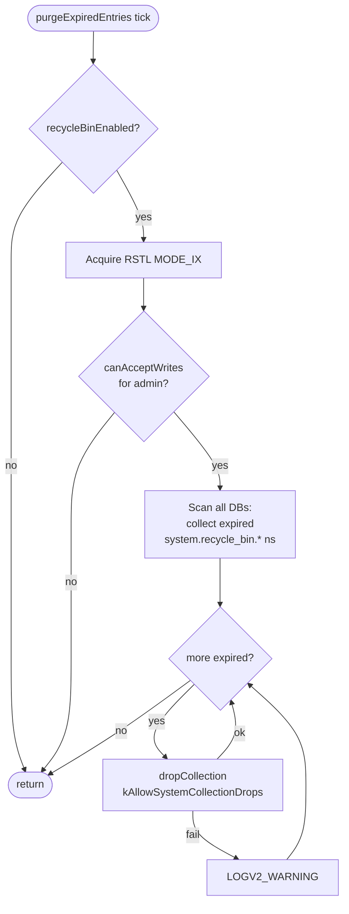
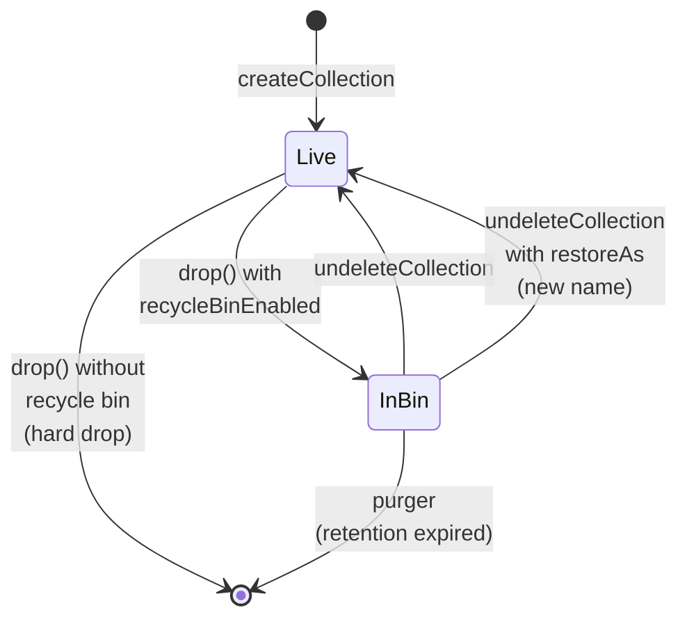

# Collection Recycle Bin

A safety net for dropped collections in Percona Server for MongoDB. When
enabled, `dropCollection` no longer destroys data immediately — instead, the
collection is renamed into a hidden recycle bin namespace from which it can be
listed, inspected, and restored until a configurable retention window expires.

## Overview

The recycle bin intercepts the drop path in the shard catalog, renames the
target collection into a `system.recycle_bin.*` namespace, and hides the entry
from normal catalog listings. A background purger scans the recycle bin on a
fixed cadence and permanently drops entries whose retention has expired.



## Server Parameters

Defined in [`recycle_bin.idl`](recycle_bin.idl). Both can be changed at startup
or at runtime via `setParameter`.

| Parameter | Type | Default | Description |
| --- | --- | --- | --- |
| `recycleBinEnabled` | `bool` | `false` | Master switch. When `false`, drops are not intercepted and the purger is a no-op. |
| `recycleBinRetentionSeconds` | `int` (> 0) | `86400` (24 h) | Seconds an entry stays in the bin before the purger removes it. |

## Admin Commands

Implemented in [`recycle_bin_commands.cpp`](recycle_bin_commands.cpp). Both are
admin-only.

### `listRecycleBin`

```js
db.adminCommand({ listRecycleBin: "<dbname>" })   // filter by db
db.adminCommand({ listRecycleBin: "" })           // across all dbs
```

Returns `{ collections: [{ ns, originalCollection, db, dropTime }, ...] }`.
Allowed on secondary. Requires `listDatabases` privilege.

### `undeleteCollection`

```js
db.adminCommand({ undeleteCollection: "<recycle_bin_ns>" })
db.adminCommand({ undeleteCollection: "<recycle_bin_ns>", restoreAs: "<target_ns>" })
```

Restores a recycle bin entry back to its original namespace, or to the
namespace given by `restoreAs`. Returns `{ restoredNs: "..." }`. Primary only.
Requires `find` on the source namespace and `insert` + `createIndex` on the
target namespace.

## Recycle Bin Namespace Format

Generated by `makeRecycleBinNss()` and parsed by `parseRecycleBinNss()` in
[`recycle_bin.cpp`](recycle_bin.cpp).

```
<db>.system.recycle_bin.<original_coll>.<drop_time_secs>
<db>.system.recycle_bin.<original_coll>.<drop_time_secs>.<uuid_prefix>
```

- `<drop_time_secs>` is the Unix epoch (seconds) at the moment of the drop.
- `<uuid_prefix>` is the first 8 hex chars of the collection UUID. It is only
  appended when the base name already exists (i.e., the same collection was
  dropped twice within the same second).
- `<original_coll>` may itself contain dots.

Parsing uses two regexes, trying the UUID-suffixed form first:

```
(.+)\.(\d+)\.[0-9a-f]{8}     # with UUID
(.+)\.(\d+)                  # without UUID
```

Trying the UUID form first disambiguates the case where the 8-character UUID
prefix happens to be all digits (otherwise that suffix could be mis-parsed as
the timestamp).

## Components



## Drop Interception

Called from
`src/mongo/db/shard_role/shard_catalog/drop_collection.cpp` before the
destructive drop is performed. If `recycleBinInterceptDrop` returns `true`, the
caller treats the drop as done.



Exclusions (`isExcludedFromRecycleBin`): `system.*`, the `local` database, any
internal database (e.g. `admin`, `config`), and the oplog. A user can never
create these through normal commands, but the guard prevents internal drops
from being recycled.

## Restore

`recycleBinRestore()` parses the source namespace, computes the target
(either `restoreAs` or the original name), verifies that the target doesn't
exist and the source does, then performs a rename.



## Background Purger

Started in `mongod_main.cpp` via `startRecycleBinPurger(ServiceContext*)`. Runs
a `PeriodicJob` every 60 s (`kPurgeCheckInterval`).



Key properties:
- **Primary only.** The RSTL guard ensures `canAcceptWritesForDatabase` is
  checked atomically with respect to replication state transitions.
- **Two-pass scan.** Expired entries are collected first, then dropped in a
  separate loop — dropping during iteration would invalidate the catalog
  snapshot.
- **Expiry rule.** An entry is expired when `nowSecs - dropTimeSecs >
  retentionSecs`.
- **Graceful shutdown.** `Cancellation` / `Interruption` exceptions are logged
  at debug level and the job exits cleanly; other `DBException`s are logged as
  warnings so the job keeps running on the next tick.

## Collection Lifecycle



While in the bin the collection is a regular MongoDB collection — the data
lives in a `<db>.system.recycle_bin.*` namespace and can be queried directly
using `getCollection(...)`. It is hidden from `listCollections` output by
a filter in
`src/mongo/db/shard_role/ddl/list_collections.cpp` (based on
`NamespaceString::isRecycleBinCollection()`).

## Public API

Declared in [`recycle_bin.h`](recycle_bin.h):

| Function | Purpose |
| --- | --- |
| `makeRecycleBinNss(nss, dropTimeSecs, uuid?)` | Build a recycle bin namespace. |
| `parseRecycleBinNss(nss)` | Extract original collection name and drop time. Returns `boost::none` on mismatch. |
| `recycleBinInterceptDrop(opCtx, nss, expectedUUID, reply)` | Called from the drop path. Returns `true` if the drop was redirected. |
| `recycleBinRestore(opCtx, rbNss, restoreAs?)` | Rename a recycle bin entry back to a live namespace. Returns the target `NamespaceString`. |
| `recycleBinList(opCtx, dbName)` | Enumerate entries in one database, or all if `dbName` is empty. |
| `startRecycleBinPurger(sc)` / `shutdownRecycleBinPurger(sc)` | Lifecycle hooks for the background job. |

## Tests

- **Unit tests** — [`recycle_bin_test.cpp`](recycle_bin_test.cpp). Covers
  `makeRecycleBinNss` / `parseRecycleBinNss` for basic, UUID-suffixed,
  all-digit-UUID, dotted-collection-name, and malformed inputs; plus a
  round-trip check.
- **Integration tests** — `jstests/recycle_bin/recycle_bin.js` run via the
  `recycle_bin` resmoke suite. Covers drop interception, restore (with and
  without `restoreAs`), namespace conflicts, collision handling (same name
  dropped twice in one second), cross-database listing, index preservation,
  and purger-driven expiry.

Run with:

```
bazel test //src/mongo/db/recycle_bin:recycle_bin_test
python buildscripts/resmoke.py run --suites=recycle_bin
```
